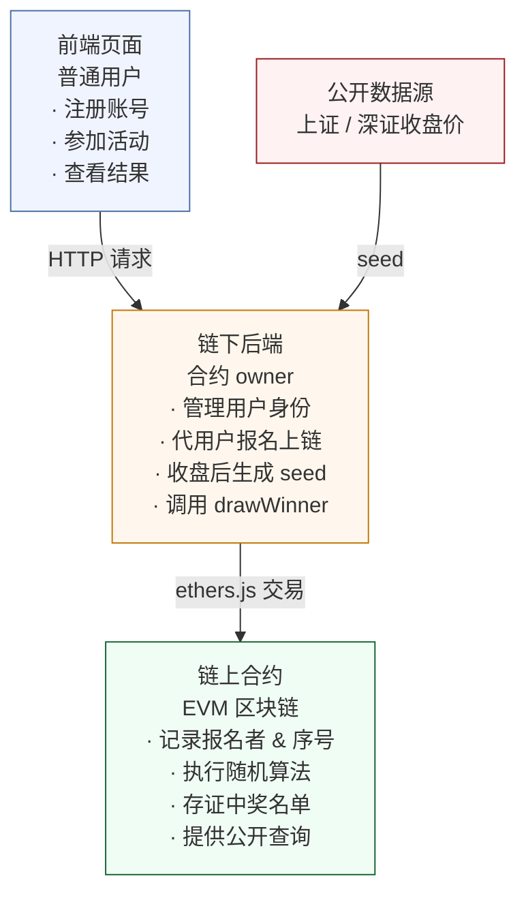
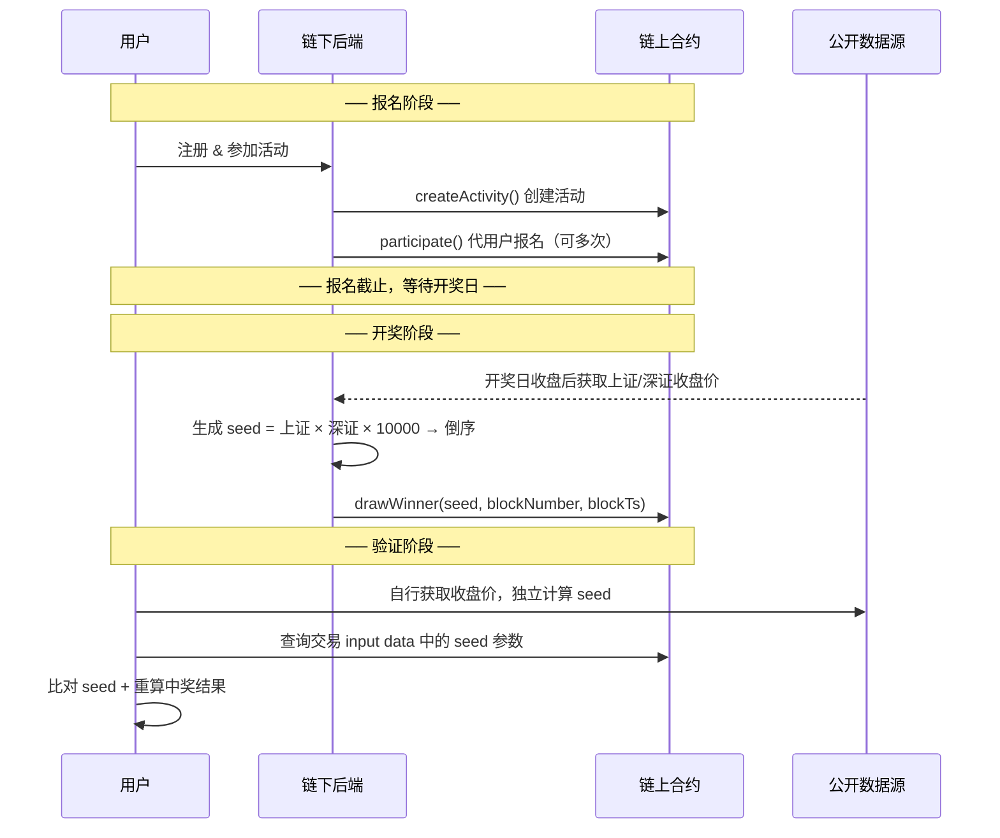
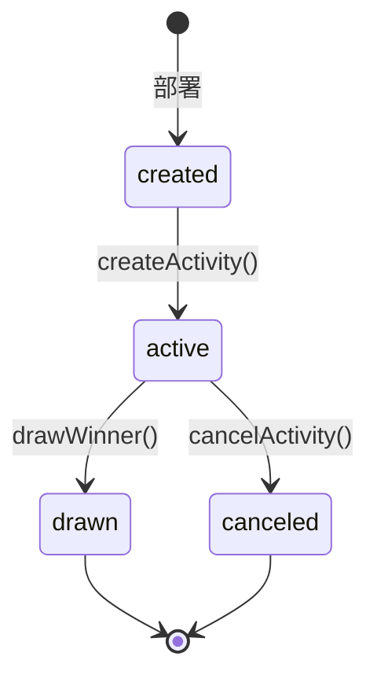

# MyLuckyDraw - 链上透明抽奖系统

基于 Solidity 的链上抽奖合约。采用 **前端页面 + 链下后端 + 链上合约** 的架构，用户在普通网页上即可参与抽奖，无需钱包或 Web3 知识，由区块链保障抽奖过程的公开透明。

## 架构设计



## 开奖流程



## 信任模型

### 传统抽奖的信任问题

普通线上抽奖的信任模型是"相信我，我没作弊"。用户只能看到中奖名单，无从验证抽奖过程是否公正——平台可能在报名截止后篡改参与者名单，也可能直接指定内定中奖者。

### 本系统的解决思路

本系统将信任对象从"平台"转移到"代码 + 公开数据"：

| 信任锚点 | 说明 |
|----------|------|
| **链上存证** | 报名记录一旦上链即不可篡改，平台无法在事后增删参与者 |
| **外部随机源** | seed 来自上证/深证收盘价，平台无法操控，所有人都能独立计算验证 |
| **确定性算法** | 给定相同的 seed + 参与名单 → 必然输出相同的中奖结果，不存在暗箱空间 |
| **完全可验证** | 合约源码公开、链上数据公开、seed 公式公开，任何人可独立重放验证 |

**一句话总结：** 区块链在这里不是"去中心化"，而是"自证清白"——平台把抽奖全流程搬到链上，等于把自己放在阳光下，没有任何作弊的余地。

### 信任边界（重要）

本系统的链上保障是**报名截止后**生效的。在报名阶段，由于采用"后端代签"模式（用户无需钱包），存在以下天然限制：

| 阶段 | 平台能力 | 能否被链上防止 |
|------|----------|---------------|
| **报名阶段** | 可以拒绝某些用户报名（在链下拦截） | ❌ 不能。用户无法绕过前端直接调用合约 |
| **报名阶段** | 可以用自己生成的地址报名，增加中奖概率 | ❌ 不能。任何"无门槛"架构都难以根除 Sybil 攻击 |
| **报名截止后** | 增删或修改参与者名单 | ✅ 不能。名单已上链，不可篡改 |
| **开奖阶段** | 伪造 seed | ✅ 不能。seed 来自公开股市数据，任何人可独立验算 |
| **开奖阶段** | 篡改中奖算法或结果 | ✅ 不能。算法开源且确定性执行，链上留痕 |

> **结论**：本系统保证的是**"报名截止后的全流程可验证、不可篡改"**。报名阶段的公平性依赖平台的商业信誉，这也是"无钱包零门槛"产品定位的必要 trade-off。

## 安全性论证

### 平台能否作弊？

平台作为合约 owner，确实是唯一能调用 `participate` 和 `drawWinner` 的角色。在报名截止后，它无法在不被发现的情况下作弊：

1. **无法增删参与者（截止后）**：报名记录在截止时已全部上链，任何修改都是一笔公开交易，链上永久留痕
2. **无法操控 seed**：seed 由公开市场数据计算，平台不能自己编一个数，因为任何人都可以用当天收盘价重新计算并比对
3. **无法选择性开奖**：算法是确定性的，给定 seed、参与名单和开奖区块参数 → 结果是唯一的
4. **无法内定中奖者**：除非平台能提前预测收盘价，并且在报名阶段就植入恰好会中奖的地址——这等价于预测股市，不可行

> **注意**：早期合约代码中 `drawWinner` 的 `blockNumber` 和 `blockTs` 由后端传入，这曾是信任漏洞（平台可通过微调参数改变结果）。当前版本已改为从链上直接读取 `block.number` 和 `block.timestamp`，消除此攻击面。

### 用户如何独立验证？

```
收盘价（人人可查） → 算出 seed → 找到链上 drawWinner 交易的 seed 参数 → 比对一致
                                                                    → 用相同算法重算 → 比对链上中奖名单
```

全程无需信任平台。一个技术用户可以写几十行脚本完成自动验证。

### 攻击面分析

| 攻击手段 | 可行性 | 原因 |
|----------|--------|------|
| 预测 seed 提前布局 | 不可行 | 需要在报名阶段预测未来收盘价 |
| 篡改链上报名记录 | 不可行 | 区块链不可篡改 |
| 伪造 seed | 不可行 | 任何人都能用公开收盘价验证 |
| 矿工操纵区块数据 | 无意义 | 随机性来自外部 seed，不依赖区块数据 |
| 平台拒绝开奖 | 可检测 | 合约状态公开，超期未开奖可被社区发现 |

## Seed 生成算法

```
seed = 上证指数收盘值 × 深证成指收盘值 × 10000 → 取整数部分（12 位） → 倒序排列
```

示例：上证 3200.15，深证 10800.50 → `3200.15 × 10800.50 × 10000` → 取整 → 倒序 → seed。

报名在收盘前截止，此时收盘价未知、seed 不可计算。收盘价公布后 seed 确定，但参与者名单已锁定在链上。

## 合约结构

### Ownable — 所有权管理

部署者为初始 owner，支持转移所有权。

### MyLuckyDraw — 抽奖主合约

**活动状态流转：**



**核心函数：**

| 函数 | 调用者 | 说明 |
|------|--------|------|
| `createActivity` | owner | 创建活动（名称、起止时间、中奖人数） |
| `participate` | owner | 代用户报名，记录地址和序号 |
| `drawWinner` | owner | 传入 seed 执行抽奖，返回中奖者索引 |
| `luckyOf` | 任意 | 查询中奖者地址列表 |
| `luckyIndexOf` | 任意 | 查询中奖者索引列表 |
| `ifLuckyOf` | 任意 | 检查某地址是否中奖 |
| `indexOf` | 任意 | 查询某地址的报名序号 |
| `participantNumOf` | 任意 | 查询活动报名人数 |
| `statusOf` | 任意 | 查询活动当前状态 |
| `cancelActivity` | owner | 取消活动 |


**随机算法：**
- 首个中奖者：`keccak256(blockTs, blockNumber, seed) % 参与人数`
- 后续中奖者：`keccak256(前一中奖索引, blockTs, blockNumber, seed) % 参与人数`
- 防碰撞：若抽中已中奖者，自动顺延至下一个未中奖者

## 技术方案

当前仅完成了链上合约部分，后续将补全链下后端和前端页面。整体技术选型如下：

| 层 | 技术 | 说明 |
|----|------|------|
| 链上合约 | Solidity + Hardhat | 已完成 |
| 链下后端 | Go | 练习 Go 开发 |
| 数据库 | MySQL | 用户、活动、报名记录等 |
| 前端 | 原生 JS + CSS | 尽量轻量，UI 做好看 |

### 项目目录结构

```
lucky-draw/
├── blockchain/                 # 链上合约 (Hardhat)
│   ├── contracts/
│   │   └── MyLuckDraw.sol
│   ├── scripts/
│   │   ├── deploy.js
│   │   └── run.js
│   ├── test/
│   ├── hardhat.config.js
│   └── package.json
├── backend/                    # Go 后端 (待开发)
│   ├── cmd/server/main.go
│   ├── internal/
│   │   ├── config/             # 配置（数据库、链节点、JWT 等）
│   │   ├── handler/            # HTTP handlers
│   │   ├── middleware/         # 认证、CORS 等中间件
│   │   ├── model/              # 数据模型
│   │   ├── repository/         # 数据库访问层 (GORM)
│   │   ├── service/            # 业务逻辑层
│   │   └── contract/           # 链上合约交互（go-ethereum 绑定）
│   ├── migrations/             # SQL 迁移文件
│   ├── go.mod
│   └── go.sum
├── frontend/                   # 前端 (待开发)
│   ├── index.html
│   ├── css/
│   │   └── style.css
│   ├── js/
│   │   ├── api.js
│   │   ├── app.js
│   │   └── utils.js
│   └── assets/
├── database/                   # 数据库 (待开发)
│   └── migrations/             # SQL DDL
├── .claude/                    # Claude Code skill 配置
└── README.md
```

### Go 后端设计

**依赖包：**

| 包 | 用途 |
|----|------|
| `github.com/gin-gonic/gin` | HTTP 框架，路由和中间件 |
| `github.com/ethereum/go-ethereum` | 连接以太坊节点，调用合约 |
| `gorm.io/gorm` + `gorm.io/driver/mysql` | ORM 和 MySQL 驱动 |
| `github.com/golang-jwt/jwt/v5` | 用户认证 JWT |
| `github.com/robfig/cron/v3` | 定时任务（自动开奖等） |

**内部模块职责：**

```
handler  ←→  service  ←→  repository  ←→  MySQL
                ↕
            contract   ←→  go-ethereum  ←→  链节点 (Hardhat / 以太坊)
```

- **handler** — 解析 HTTP 请求，调用 service，返回响应。不含业务逻辑
- **service** — 核心业务逻辑。报名时：写库 → 调合约 → 回写 tx_hash；开奖时：获取行情 → 生成 seed → 调合约 → 存结果
- **repository** — 纯粹的数据库 CRUD，使用 GORM
- **contract** — 合约 ABI 绑定，提供 `CreateActivity()`、`Participate()`、`DrawWinner()` 等方法，封装 nonce 管理、gas 估算、交易等待
- **middleware** — JWT 校验、CORS、请求日志

**API 设计：**

```
# 认证
POST   /api/auth/register              # 注册（用户名、邮箱、密码）
POST   /api/auth/login                 # 登录，返回 JWT

# 活动（公开）
GET    /api/activities                 # 活动列表（分页、状态筛选）
GET    /api/activities/:id             # 活动详情 + 报名人数 + 状态
GET    /api/activities/:id/winners     # 中奖者列表（开奖后）
GET    /api/activities/:id/verify      # 验证数据（seed、上证/深证值、区块信息）

# 活动（admin）
POST   /api/admin/activities           # 创建活动 → 调合约 createActivity

# 报名（需登录）
POST   /api/activities/:id/register    # 报名 → 调合约 participate
GET    /api/users/me/registrations     # 我的报名记录

# 开奖（admin）
POST   /api/admin/activities/:id/draw  # 执行开奖 → 获取行情 → 调合约 drawWinner
```

**后端管理用户以太坊地址的方式：** 用户注册时，后端为每个用户生成一个独立的以太坊地址（HD 钱包派生或随机生成），该地址由后端托管，用户无感知。报名时后端使用该地址调用合约的 `participate()`。

### 数据库设计

```sql
-- 用户表
CREATE TABLE users (
    id           BIGINT AUTO_INCREMENT PRIMARY KEY,
    username     VARCHAR(64)  NOT NULL UNIQUE,
    email        VARCHAR(128) NOT NULL UNIQUE,
    password     VARCHAR(256) NOT NULL,          -- bcrypt hash
    eth_address  VARCHAR(42)  NOT NULL UNIQUE,   -- 后端托管的以太坊地址
    created_at   DATETIME     NOT NULL DEFAULT CURRENT_TIMESTAMP
);

-- 活动表（缓存链上数据，便于前端列表查询）
CREATE TABLE activities (
    id            BIGINT AUTO_INCREMENT PRIMARY KEY,
    contract_name VARCHAR(128) NOT NULL UNIQUE,   -- 对应合约中的活动名
    display_name  VARCHAR(256) NOT NULL,
    description   TEXT,
    start_time    DATETIME     NOT NULL,
    end_time      DATETIME     NOT NULL,
    lucky_count   INT          NOT NULL,
    status        ENUM('active','drawn','canceled') NOT NULL DEFAULT 'active',
    create_tx     VARCHAR(66),                    -- createActivity 交易 hash
    created_at    DATETIME     NOT NULL DEFAULT CURRENT_TIMESTAMP
);

-- 报名记录表
CREATE TABLE registrations (
    id            BIGINT AUTO_INCREMENT PRIMARY KEY,
    user_id       BIGINT NOT NULL,
    activity_id   BIGINT NOT NULL,
    chain_index   INT    NOT NULL,                -- 合约返回的参与者序号
    tx_hash       VARCHAR(66),
    created_at    DATETIME NOT NULL DEFAULT CURRENT_TIMESTAMP,
    FOREIGN KEY (user_id)     REFERENCES users(id),
    FOREIGN KEY (activity_id) REFERENCES activities(id),
    UNIQUE KEY uk_user_activity (user_id, activity_id)
);

-- 开奖结果表
CREATE TABLE draw_results (
    id              BIGINT AUTO_INCREMENT PRIMARY KEY,
    activity_id     BIGINT        NOT NULL UNIQUE,
    seed            VARCHAR(32)   NOT NULL,       -- 开奖 seed
    shanghai_index  DECIMAL(10,2) NOT NULL,       -- 上证收盘价
    shenzhen_index  DECIMAL(10,2) NOT NULL,       -- 深证收盘价
    block_number    BIGINT        NOT NULL,       -- drawWinner 交易所在区块
    block_ts        BIGINT        NOT NULL,
    tx_hash         VARCHAR(66),
    drawn_at        DATETIME      NOT NULL DEFAULT CURRENT_TIMESTAMP,
    FOREIGN KEY (activity_id) REFERENCES activities(id)
);

-- 中奖者表
CREATE TABLE winners (
    id           BIGINT AUTO_INCREMENT PRIMARY KEY,
    activity_id  BIGINT NOT NULL,
    user_id      BIGINT NOT NULL,
    win_order    INT    NOT NULL,                 -- 中奖顺序 (0, 1, 2...)
    FOREIGN KEY (activity_id) REFERENCES activities(id),
    FOREIGN KEY (user_id)     REFERENCES users(id)
);
```

**表关系：** `users` 1—N `registrations` N—1 `activities`。`activities` 1—1 `draw_results`，`activities` 1—N `winners` N—1 `users`。

### 前端页面设计

| 页面 | 路由 | 说明 |
|------|------|------|
| 首页 | `/` | 活动列表卡片，显示名称、时间、状态、报名人数 |
| 活动详情 | `/activity.html?id=1` | 活动信息、报名按钮、参与者列表、开奖后展示中奖者 |
| 登录注册 | `/login.html` | 登录/注册切换表单 |
| 个人中心 | `/user.html` | 我的报名、我的中奖记录 |
| 验证页面 | `/verify.html?id=1` | 展示 seed、上证/深证收盘价，提供独立验证指引 |

前端用原生 JS 实现，不做 SPA，每个页面独立 HTML。API 调用封装在 `api.js`。UI 风格后续单独打磨。

### 开发顺序

1. **Go 后端骨架** — 项目初始化、配置、数据库连接、GORM 自动迁移
2. **用户模块** — 注册、登录、JWT 中间件
3. **活动模块** — 创建活动（调合约 + 写库）、活动列表、活动详情
4. **报名模块** — 报名（调合约 + 写库）、我的报名
5. **开奖模块** — 获取行情数据、生成 seed、调合约 drawWinner、存结果、查询中奖者
6. **前端页面** — 按页面逐个开发，接上后端 API
7. **UI 打磨** — 统一设计风格，交互动效
8. **验证工具** — 独立的验证脚本或页面功能，输入活动 ID 自动拉取链上数据做重算

## 快速开始

```shell
# 进入合约目录
cd blockchain

# 安装依赖
npm install

# 编译合约
npx hardhat compile

# 本地运行 Hardhat 节点
npx hardhat node

# 部署合约到本地节点
npx hardhat run scripts/deploy.js --network localhost

# 本地运行模拟脚本（创建活动 → 报名 → 开奖 → 查询）
npx hardhat run scripts/run.js
```

## 待改进项

### 合约层（当前迭代重点）

- **`drawWinner` 区块参数信任漏洞** ✅ 已确认修复方案：将 `blockNumber` 和 `blockTs` 从"后端传入"改为链上直接读取（`block.number` / `block.timestamp`），防止平台通过微调参数操控结果
- **seed 未存储在合约状态中**：目前需从交易 input data 获取，建议在合约中增加 `activitySeed` mapping，并在 `drawWinner` 中 emit `WinnerDrawn` 事件携带 seed，降低验证门槛
- **`triggerDraw()` 为残留代码且逻辑错误**（`MyLuckDraw.sol` ~L183）：该函数将状态错误地设为 `active` 而非 `drawing`，且修改了 `startTime`。由于 `drawWinner` 可直接调用，建议删除此函数以简化状态机
- **`participate` 未挂时间校验修饰符**：当前 `participate` 没有使用 `onlyActive`，导致活动未开始、已结束或被取消时仍可报名。需要补上状态和时间窗口检查
- **生产合约不应 `import "hardhat/console.sol"`**：调试代码会增大合约体积且在其他环境不兼容，部署前应移除
- **多个函数不必要标记 `payable`**：`createActivity`、`participate`、`drawWinner`、`cancelActivity` 均不接收 ETH，`payable` 增加误转账风险
- **`drawed` 拼写错误**：合约状态枚举和多处文案使用 `drawed`，正确应为 `drawn`（已同步修正 README）
- **缺少关键事件**：`createActivity` 和 `participate` 应分别 emit 事件，便于链下索引和审计
- **`luckyOf` 数组长度潜在问题**：当实际中奖人数少于 `luckyCount` 时，`luckyAddresses` 会包含空地址，建议按 `winnerIndexs.length` 分配数组
- **未编写测试**：`test/` 目录为空
- **`deploy.js` 未更新**：仍为 Hardhat 初始模板，应改为部署 `MyLuckyDraw` 合约

### 后端层（后续迭代）

- 数据库连接失败时未优雅退出，存在 nil DB panic 风险
- 未配置 GORM 连接池参数
- `.env` 中的 `BLOCKCHAIN_PRIVATE_KEY` 未被配置模块读取
- 缺少请求限流、JWT 认证、参数校验等中间件
- 错误码为硬编码魔法数字，缺乏统一管理

## 技术栈

| 层 | 技术 |
|----|------|
| 链上合约 | Solidity ^0.8.17 / Hardhat ^2.12.3 |
| 链下后端 | Go (Gin + GORM + go-ethereum) |
| 数据库 | MySQL |
| 前端 | 原生 JavaScript + CSS |

